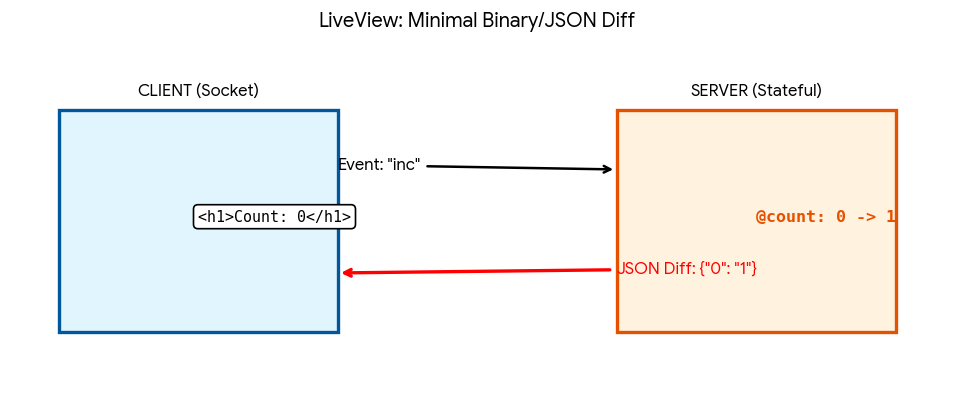
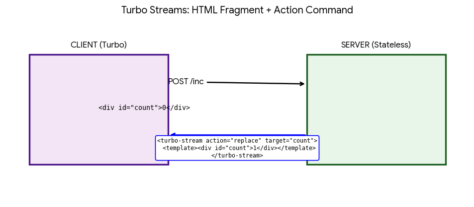
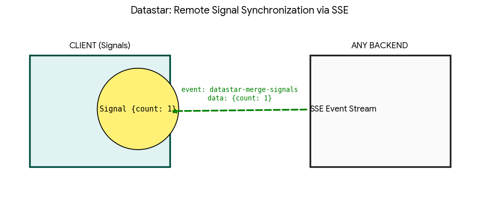
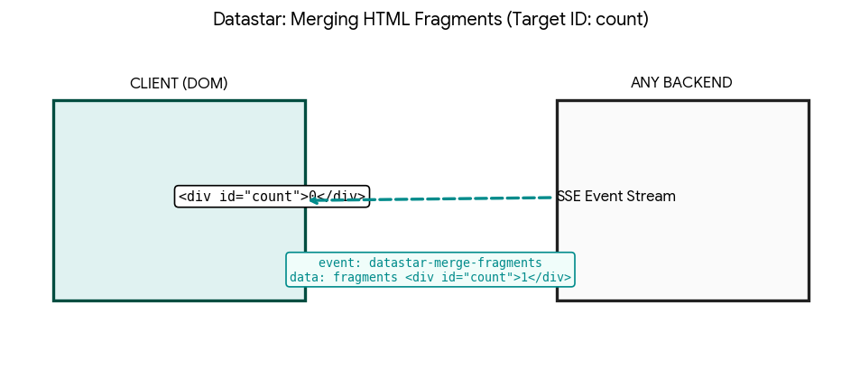

# HTML over the Wire

Comparison of concepts the **HTML over the Wire** implemented with
[Hotwire Turbo Streams][hotwire-turbo], [Phoenix LiveView][liveview], and [Datastar][datastar].

> [Examples](https://github.com/lucerion/real-time-auction)

## Phoenix LiveView

Part of the Phoenix framework for the Elixir language. It is widely considered the gold standard for This
architectural pattern.

* **Connection**: Operates via persistent WebSockets.
* **State**: The UI state is stored on the server within Erlang/Elixir processes.
* **Key Feature**: The server automatically tracks data changes and sends only minimal HTML "diffs" to the client.
This makes applications incredibly fast and network-efficient.
* **Coupling**: Strictly tied to Elixir and Phoenix.

**How it works**:

1. **Initial Load**: You make a standard HTTP GET request. The server sends back fully rendered HTML for SEO
and fast first paint.
2. **Upgrade to WebSocket**: The LiveView JS client establishes a persistent connection to the server via WebSockets.
3. **State**: The server spawns a dedicated process (GenServer) that holds the data for that
specific page (e.g., @count = 0).
4. **Events**: When you click a button, the client sends a tiny message over the WebSocket: "increment_button_clicked".
5. **Diffs**: The server updates the variable in memory, re-renders the HTML template, and sends only the changed
part (the "diff," like just the number "1") back to the client.

## Hotwire Turbo Streams

The real-time communication layer of the Hotwire suite (from the creators of Ruby on Rails). While Turbo Drive handles navigation, Turbo Streams focuses on delivering granular DOM changes.

* **Connection**: Primarily uses standard HTTP POST/PATCH responses for instant updates, but seamlessly upgrades to WebSockets (via ActionCable) for asynchronous broadcasting to multiple users.
* **State**: Stateless on the server. Each Stream is a self-contained "instruction" that doesn't rely on a persistent server-side process, making it highly scalable and closer to traditional REST.
* **Key Feature**: Fragment-based orchestration. The server sends HTML snippets wrapped in `<turbo-stream>` tags that specify an action (append, prepend, replace, etc.) and a target ID.
* **Coupling**: Deeply integrated with Ruby on Rails, but the protocol is open and can be implemented in any language.

**How it works**:

1. **Action-Wrapped HTML**: The server responds with a specific media type (`text/vnd.turbo-stream.html`) containing one or multiple instructions: 
   `<turbo-stream action="append" target="messages"><template>...</template></turbo-stream>`.
2. **DOM Operations**: The Turbo client-side library receives this, parses the action, and performs the precise DOM manipulation without any custom JavaScript.
3. **HTTP-First**: Unlike LiveView, a typical update happens during a standard request-response cycle. For example, submitting a form returns a Turbo Stream that adds a new row to a table.
4. **Broadcasting**: For real-time features (like a chat), the server "pushes" these same Turbo Stream fragments over a WebSocket. The client processes them identically, whether they come from an HTTP response or a socket.
5. **Stimulus Integration**: If logic is needed beyond simple HTML replacement (e.g., triggering an animation), lightweight [Stimulus](https://hotwired.dev) controllers handle the client-side behavior.

## Datastar

A newer player positioned as a modern alternative to the htmx + Alpine.js stack.

* **Connection**: Relies heavily on Server-Sent Events (SSE) to deliver real-time updates from the server.
* **State**: Uses Signals for fine-grained client-side state management, which can be easily synchronized with
the server.
* **Key Feature**: Entirely backend-agnostic (works with Go, Rust, Python, PHP, etc.) and very lightweight (~11 KB).
It allows the server to directly control frontend reactivity via data-* attributes.

**How it works**:

1. **Signals**: You declare state variables directly in HTML using data-signals='{count: 0}'. This is local
client-side state.
2. **Two-way Binding**: data-bind synchronizes inputs with signals instantly without hitting the server.
3. **SSE (Server-Sent Events)**: Instead of heavy WebSockets, Datastar uses a one-way data stream from
the server to the client.
4. **Fragment Updates**: When the server wants to change something, it sends an SSE event: "Replace element
#result with this HTML" or "Update the 'count' signal to 10."

## Summary Table

| Feature | Phoenix LiveView | Hotwire Turbo Streams | Datastar |
| :--- | :--- | :--- | :--- |
| **Primary Protocol** | **WebSockets** (Binary/Sticky) | **HTTP** / **WebSockets** | **SSE** (Server-Sent Events) |
| **Update Mechanism** | **HTML Diffs**: Sends only the bits of data that changed. | **HTML Actions**: Sends fragments wrapped in "append/replace" commands. | **Signals & Fragments**: Updates reactive client state or merges HTML. |
| **Server State** | **Stateful**: Dedicated process per user (GenServer). | **Stateless**: Standard request/response cycle. | **Hybrid**: Stateless backend + Reactive Signals on client. |
| **Client-side Logic** | Minimal (Hooks for JS interop) | **Stimulus**: Controllers for behavior enhancement. | **Built-in Signals**: Fine-grained reactivity via attributes. |
| **Backend Language** | Elixir only | Ruby on Rails (native), Any (possible) | **Language Agnostic**: Go, Rust, Python, etc. |
| **Payload Size** | **Extremely Small**: Only raw data changes. | **Moderate**: Full HTML fragments for the updated parts. | **Small**: HTML fragments or Signal updates. |
| **Complexity** | High (Learning Elixir/OTP) | Moderate (Standard REST flow) | Low (Declarative HTML) |

[hotwire-turbo]: https://turbo.hotwired.dev
[liveview]: https://hexdocs.pm/phoenix_live_view/Phoenix.LiveView.html
[datastar]: https://data-star.dev
